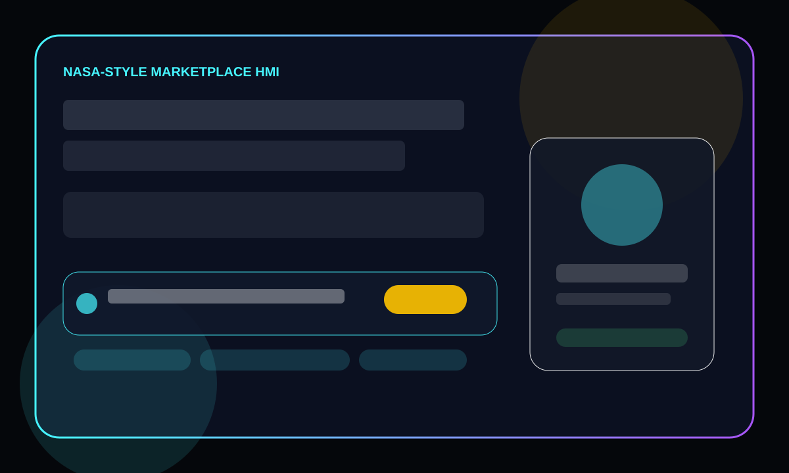
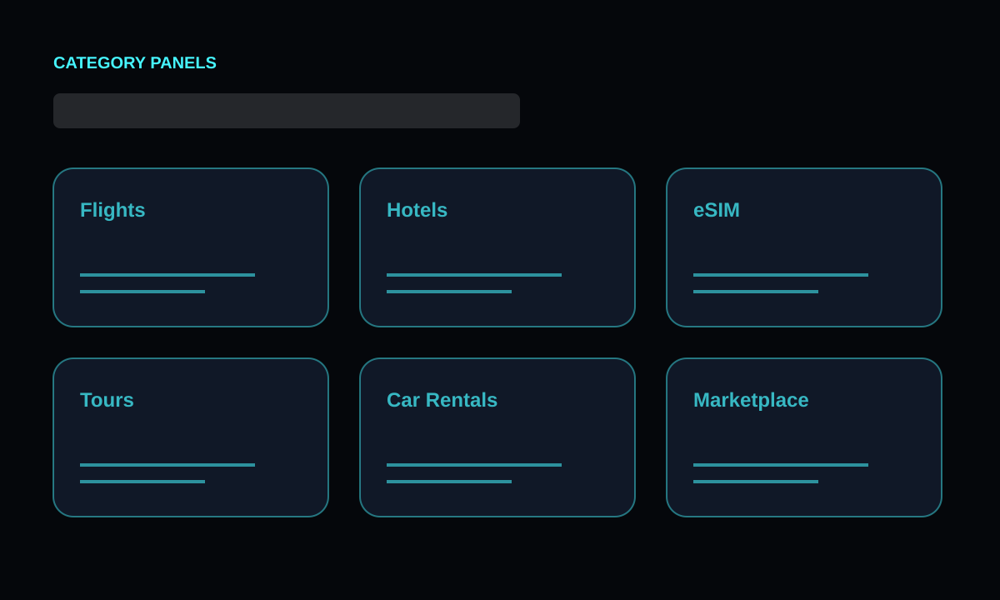
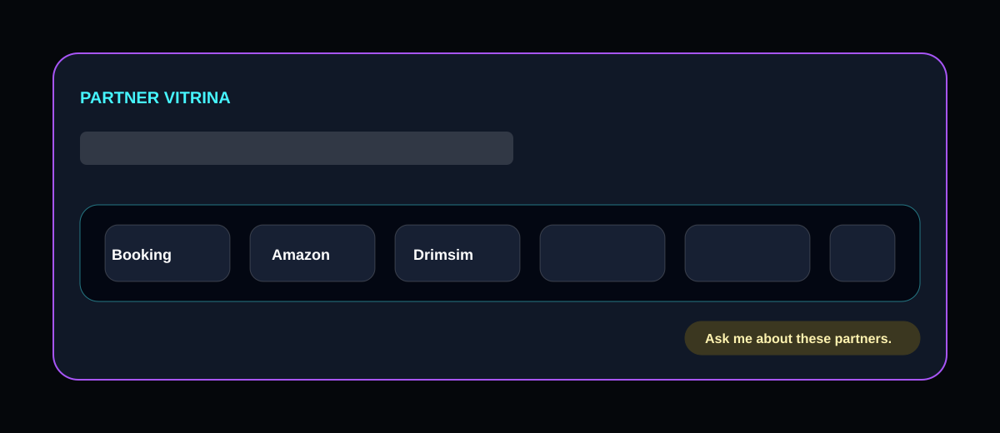
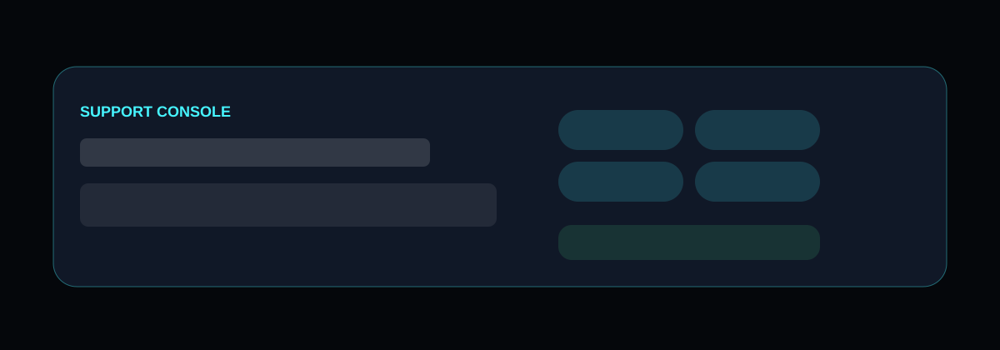

# Marketplace Homepage Wireframes — NASA-Style HMI

These wireframes were prepared before implementation to define the cockpit hierarchy, HMI interaction zones, and responsive content order for the redesigned Marketplace homepage.

## Hero Section

## Category Panels

## Partner Showcase (Vitrina)

## Executive Info Strip

## Footer

## Implementation Notes
- The hero is split between mission copy, AI-guided search, contextual suggestions, and an integrated Concierge AI widget.
- Category buttons become keyboard-focusable cockpit panels with animated telemetry lines and hover/focus quick stats.
- The partner showcase is a neon-framed carousel with Booking.com, Amazon, Drimsim, Viator, Rentalcars, and GetYourGuide.
- The executive strip keeps partner count, real-time marketplace telemetry, and a five-language cockpit toggle in one scan path.
- The footer becomes a support console with Admin, Dashboard, SaaS Modules, Pricing, and contact/support actions.
